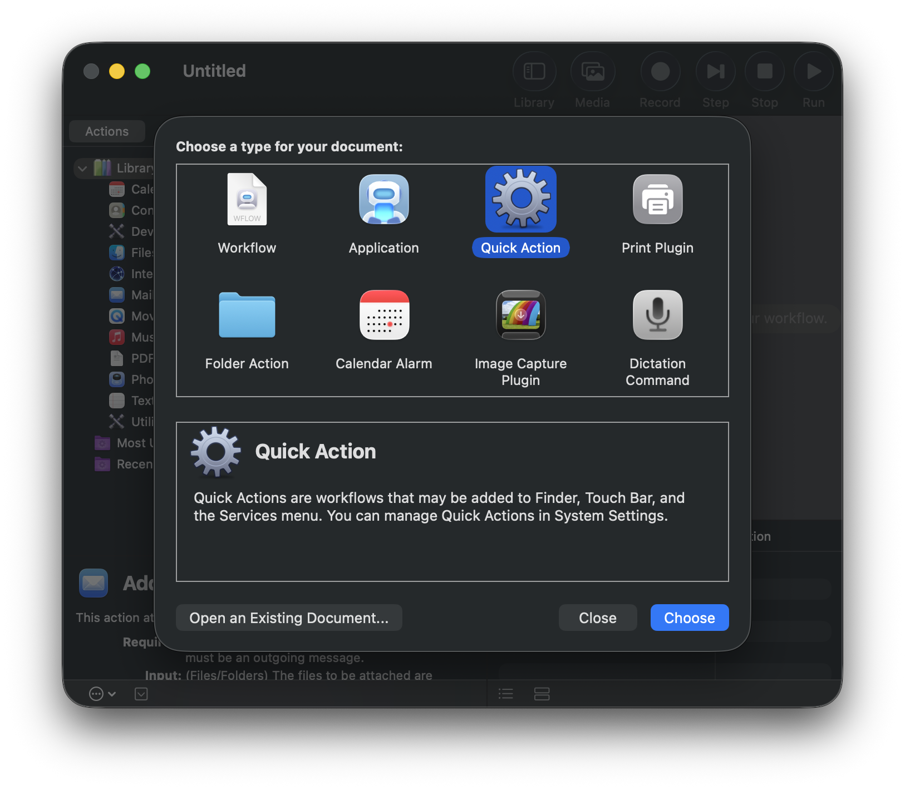
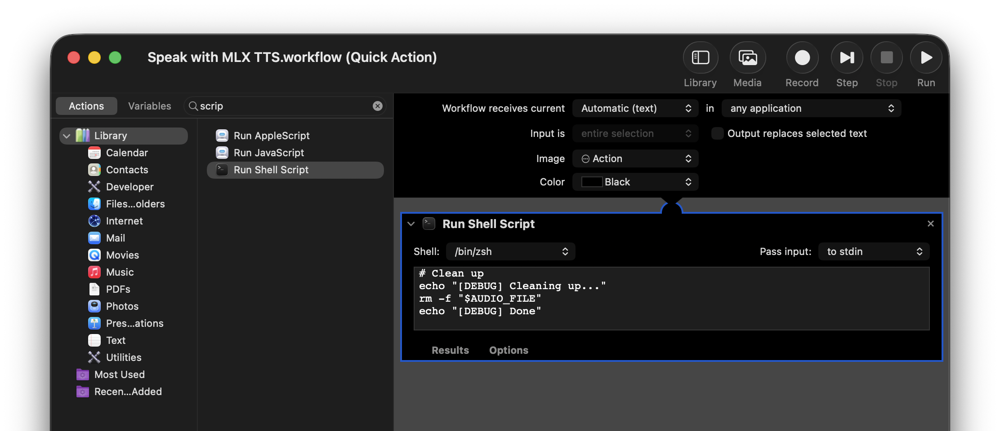

Change Directory to mlx-audio project root

Install ffmpeg with brew

```bash
brew install ffmpeg uv
```

# UV Project Flow for MLX-Audio

```sh
uv tool install . \
  --python 3.11 \
  --with uvicorn \
  --with fastapi \
  --with python-multipart \
  --with webrtcvad \
  --with fastrtc \
  --with soundfile \
  --with numpy \
  --with transformers \
  --with huggingface_hub \
  --with loguru \
  --with setuptools \
  --with pip
```

When error of pkg\_resources comes, patch with this

```sh
 #!/bin/bash
TOOL_PATH="$HOME/.local/share/uv/tools/mlx-audio/lib/python3.11/site-packages"
PKG_PATH="$TOOL_PATH/pkg_resources"

mkdir -p "$PKG_PATH"
cat > "$PKG_PATH/__init__.py" << 'EOF'
# shim to provide pkg_resources by delegating to pip vendor
from pip._vendor.pkg_resources import *
EOF

echo "pkg_resources shim installed at $PKG_PATH/__init__.py"
```

copy script and run:

```sh
pbpaste > script.sh && chmod +x script.sh && ./script.sh
```

Open new terminal session and run from anywhere to test:

```sh
mlx_audio.server --host 0.0.0.0 --port 8002
```

> Wave files may need to be reprocessed with this script if they have decoding error
> This script would be run in sample audio file directory if this is the case

```
#!/bin/zsh
# fix_wavs.sh — Re-encode all .wav files to 16-bit PCM mono 24kHz
# Only replaces originals after ALL conversions succeed.

TARGET_DIR="${1:-/Users/admin/TARGET_DIR="${1:-/Users/admin/Music/audio-clips}"/audio-clips}"
TEMP_DIR=$(mktemp -d)
FAILED=0

echo "[INFO] Scanning: $TARGET_DIR"
echo "[INFO] Temp dir: $TEMP_DIR"

typeset -a WAV_FILES
while IFS= read -r -d '' f; do
  WAV_FILES+=("$f")
done < <(find "$TARGET_DIR" -maxdepth 1 -name "*.wav" -print0)

if (( ${#WAV_FILES[@]} == 0 )); then
  echo "[INFO] No .wav files found in $TARGET_DIR"
  exit 0
fi

echo "[INFO] Found ${#WAV_FILES[@]} .wav file(s)"

# --- Pass 1: convert everything to temp dir ---
for src in "${WAV_FILES[@]}"; do
  filename=$(basename "$src")
  tmp_out="$TEMP_DIR/$filename"

  echo "[CONVERT] $filename"
  if ffmpeg -y -i "$src" -ar 24000 -ac 1 -c:a pcm_s16le "$tmp_out" -loglevel error; then
    echo "[OK]      $filename"
  else
    echo "[FAIL]    $filename"
    (( FAILED++ ))
  fi
done

# --- Abort if any conversion failed ---
if (( FAILED > 0 )); then
  echo ""
  echo "[ABORT] $FAILED conversion(s) failed — originals untouched."
  echo "[INFO]  Temp files left at: $TEMP_DIR"
  exit 1
fi

echo ""
echo "[INFO] All conversions succeeded. Replacing originals..."

# --- Pass 2: replace originals only after full success ---
for src in "${WAV_FILES[@]}"; do
  filename=$(basename "$src")
  tmp_out="$TEMP_DIR/$filename"
  mv "$tmp_out" "$src"
  echo "[REPLACED] $filename"
done

rm -rf "$TEMP_DIR"
echo ""
echo "[DONE] ${#WAV_FILES[@]} file(s) replaced."
```

> The above script was discovered after this test

`ffmpeg -i alex_standup_model-1_10s.wav -ar 24000 -ac 1 -c:a pcm_s16le alex_ref_fixed.wav`

> ❌ Error loading audio sample

```
admin@Admins-MacBook-Pro mlx-audio % mlx_audio.server --host 0.0.0.0 --port 8002

...

  File "/Users/admin/.local/share/uv/tools/mlx-audio/lib/python3.11/site-packages/mlx_audio/server.py", line 279, in generate_audio

    ref_audio = load_audio(

                ^^^^^^^^^^^

  File "/Users/admin/.local/share/uv/tools/mlx-audio/lib/python3.11/site-packages/mlx_audio/utils.py", line 560, in load_audio

    samples, orig_sample_rate = audio_read(audio)

                                ^^^^^^^^^^^^^^^^^

  File "/Users/admin/.local/share/uv/tools/mlx-audio/lib/python3.11/site-packages/mlx_audio/audio_io.py", line 223, in read

    info = miniaudio.get_file_info(str(file))

           ^^^^^^^^^^^^^^^^^^^^^^^^^^^^^^^^^^

  File "/Users/admin/.local/share/uv/tools/mlx-audio/lib/python3.11/site-packages/miniaudio.py", line 175, in get_file_info

    return wav_get_file_info(filename)

           ^^^^^^^^^^^^^^^^^^^^^^^^^^^

  File "/Users/admin/.local/share/uv/tools/mlx-audio/lib/python3.11/site-packages/miniaudio.py", line 625, in wav_get_file_info

    raise DecodeError("could not open/decode file")
```

Package server as app with automator for quick launch:
!\[\[Pasted image 20260312212720.png]]

```sh
#!/bin/bash

# Restore PATH so ffmpeg at /opt/homebrew/bin is visible to the server process
export PATH="/opt/homebrew/bin:/opt/homebrew/sbin:/usr/local/bin:/usr/bin:/bin:/usr/sbin:/sbin:$PATH"

LOGFILE="/tmp/mlx-audio.log"

echo "[$(date)] Checking port 8002..." >> "$LOGFILE"

if ! lsof -i :8002 > /dev/null 2>&1; then
  echo "[$(date)] Port 8002 free. Starting mlx_audio.server..." >> "$LOGFILE"
  nohup /Users/admin/.local/share/uv/tools/mlx-audio/bin/mlx_audio.server \
    --host 0.0.0.0 --port 8002 >> "$LOGFILE" 2>&1 &
  PID=$!
  echo "[$(date)] mlx_audio.server started (PID: $PID)" >> "$LOGFILE"
  osascript -e "display notification \"mlx_audio.server started on 8002 (PID $PID)\" with title \"MLX Audio\""
else
  echo "[$(date)] Port 8002 already in use." >> "$LOGFILE"
  osascript -e "display notification \"mlx_audio.server already running on 8002\" with title \"MLX Audio\""
fi
```

Instructions:

1. Open Automator > New > Application.
2. Search/add "Run Shell Script".
3. Paste script, set Shell: /bin/zsh, Pass input: ignore.
4. CMD > Save as MLX Audio Starter.app in Applications.
5. System Settings > General > Login Items > Add the app (toggle "Allow in Background" if hidden).
   ​
   To kill task if needed:

```
sudo lsof -ti :8002 | xargs sudo kill -9
```

***

> Set Cache Dir if you wish to store models in non-default location

```jsx
export UV_CACHE_DIR="/Volumes/X9 Pro/cache/uv"
```

Check uv cache dir

```jsx
uv cache dir 
```

Download model

> mlx-community/Qwen3-TTS-12Hz-1.7B-VoiceDesign-8bit

```bash
curl -X POST http://localhost:8002/v1/audio/speech \
  -H "Content-Type: application/json" \
  -d '{
    "model": "mlx-community/Qwen3-TTS-12Hz-1.7B-VoiceDesign-8bit",
    "input": "M3 Ultra. Our most advanced chip delivers unprecedented power for the most demanding professionals. Whether you'\''re loading massive datasets for large language models, editing a feature film, or composing a symphony, this chip does it all.",
    "voice": "custom",
    "instruct": "gender: Male.\npitch: Intense mid-range that drops to a whisper when revealing '\''the truth'\'' about paprika.\nspeed: Rapid-fire tangents interrupted by suspicious glances off-camera.\nvolume: Conversational until suddenly hissing secret information about Big Flour.\nage: Older adult (60s).\nclarity: Mumbles during recipes, crystal clear when explaining cover-ups.\nfluency: Constantly derailed by connections only he can see.\naccent: Brooklyn New York with occasional unexplained Eastern European words.\ntexture: Gravelly and conspiratorial, like a deli owner with secrets.\nemotion: Paranoid excitement, vindicated rage at the culinary establishment.\ntone: Instructional segments hijacked by passionate exposés.\npersonality: Earnest, suspicious of ingredients, surprisingly good at making soup.",
    "speed": 1.0,
    "seed": 42
  }' \
  --output output.wav

```

> After creating a custom voice with mlx-community/Qwen3-TTS-12Hz-1.7B-VoiceDesign-8bit
> Create 10 Second Snippet with same audio properties

```
ffmpeg -i '{track-name}.wav' -t 10 -c:a copy '{track-name}_10s.wav'
```

> Or for multiple voice designs batch convert them

[batchVoiceSampleCreation.sh](./scripts/10S-batch-voice-sample-creation.sh)

```
#!/bin/bash

for f in *.wav; do
  [[ "$f" == *_10s.wav ]] && continue
  base="${f%.wav}"
  ffmpeg -i "$f" -t 10 -c:a copy "${base}_10s.wav"
done

```

> Voice samples could be passed along with the reference text up to 10 seconds to the model
> mlx-community/Qwen3-TTS-12Hz-1.7B-Base-8bit
> Some sample audio clips are available in this repo at automator/sample-audio-clips/

```sh
 curl -X POST http://localhost:8002/v1/audio/speech \
  -H "Content-Type: application/json" \
  -d '{
    "model": "mlx-community/Qwen3-TTS-12Hz-1.7B-Base-8bit",
    "input": "The text you want spoken goes here.",
    "voice": "custom",
     "ref_audio": "/Users/admin/Music/sample-audio-clips/narrator_connection_lifecycle_10s.wav",
      "ref_text": "Section 3.2 - Connection Lifecycle Management. When a client initiates a connection, the handshake sequence proceeds in three distinct phases.",
      "speed": 1.0,
      "seed": 42
    }' \
    --output output.wav
```

\[\[MLX Audio Design Voice Characters]]

Run Server

```bash
mlx_audio.server --host 0.0.0.0 --port 8002
```

```bash
uv run mlx_audio.server --host 0.0.0.0 --port 8002
```

```jsx
cd mlx_audio/ui/
npm i
npm run dev:https
```

***

Setup with MacOS Automator





> Automator Script using mlx-community/Kokoro-82M-bf16

```bash
#!/bin/zsh

PID_FILE="/tmp/tts_player.pid"

# Check if audio is currently playing
if [ -f "$PID_FILE" ]; then
  PLAYER_PID=$(cat "$PID_FILE")
  echo "[DEBUG] Found PID file with PID: $PLAYER_PID"
  
  # Check if process is still running
  if kill -0 $PLAYER_PID 2>/dev/null; then
    echo "[DEBUG] Audio is playing, stopping player process $PLAYER_PID"
    kill $PLAYER_PID 2>/dev/null
    rm -f "$PID_FILE"
    osascript -e 'display notification "Audio playback stopped." with title "TTS Stop"'
    echo "[DEBUG] Player stopped"
    exit 0
  else
    echo "[DEBUG] Process $PLAYER_PID not running, cleaning up stale PID file"
    rm -f "$PID_FILE"
  fi
fi

# If we reach here, no audio is playing - proceed with playing selected text
echo "[DEBUG] No audio playing, proceeding to play selected text"

# Read selected text from stdin only if data is available (avoid blocking)
if [ -p /dev/stdin ]; then
  TEXT=$(cat)
else
  TEXT=""
fi

echo "[DEBUG] Text to convert: $TEXT"

# Bail out if nothing was selected
if [ -z "$TEXT" ]; then
  echo "[DEBUG] No text provided, exiting"
  osascript -e 'display notification "No text selected." with title "TTS"'
  exit 1
fi

TTS_HOST="http://localhost:8002"
AUDIO_DIR="/tmp/mlx_tts"
mkdir -p "$AUDIO_DIR"
echo "[DEBUG] TTS Host: $TTS_HOST"
echo "[DEBUG] Audio directory: $AUDIO_DIR"

# Generate a unique filename for this audio
AUDIO_FILE="$AUDIO_DIR/tts_$(date +%s).mp3"
echo "[DEBUG] Audio file: $AUDIO_FILE"

# Build JSON payload safely so quotes, backslashes, newlines, etc. don't break it
if ! command -v jq &>/dev/null; then
  echo "[DEBUG] jq not found — install it with: brew install jq"
  osascript -e 'display notification "jq is required but not installed. Run: brew install jq" with title "TTS Error"'
  exit 1
fi
JSON_PAYLOAD=$(jq -n \
  --arg model "mlx-community/Kokoro-82M-bf16" \
  --arg input "$TEXT" \
  --argjson speed 1.2 \
  '{model: $model, input: $input, speed: $speed}')
echo "[DEBUG] JSON payload built successfully"

# Call the TTS server — POST /v1/audio/speech with JSON
echo "[DEBUG] Calling TTS server..."
HTTP_CODE=$(curl -w "%{http_code}" -X POST "$TTS_HOST/v1/audio/speech" \
  -H "Content-Type: application/json" \
  -d "$JSON_PAYLOAD" \
  -o "$AUDIO_FILE")
echo "[DEBUG] HTTP Response Code: $HTTP_CODE"

if [ "$HTTP_CODE" != "200" ]; then
  echo "[DEBUG] TTS server error (HTTP $HTTP_CODE)"
  osascript -e 'display notification "TTS server error. Check that mlx_audio is running on port 8002." with title "TTS Error"'
  exit 1
fi

# Play it in background and track PID
echo "[DEBUG] Playing audio..."
afplay "$AUDIO_FILE" &
PLAYER_PID=$!
echo "[DEBUG] Player PID: $PLAYER_PID"

# Store PID for stop script
echo $PLAYER_PID > "$PID_FILE"

# Wait for playback to complete
wait $PLAYER_PID 2>/dev/null
EXIT_CODE=$?
echo "[DEBUG] Playback complete (exit code: $EXIT_CODE)"

# Clean up
echo "[DEBUG] Cleaning up..."
rm -f "$AUDIO_FILE"
rm -f "$PID_FILE"
echo "[DEBUG] Done"

```

> Automator Script using mlx-community/Qwen3-TTS-12Hz-0.6B-Base-6bit
> Using voice sample: mark\_trustworthy\_10s
> **Automator Script Title:** Speak with MLX TTS ({Character\_Name}) (Quick Action).work

[Automator Shell Script](./scripts/character-automator-base-script.sh)

```sh
#!/bin/zsh

PID_FILE="/tmp/tts_player.pid"

# Check if audio is currently playing
if [ -f "$PID_FILE" ]; then
  PLAYER_PID=$(cat "$PID_FILE")
  echo "[DEBUG] Found PID file with PID: $PLAYER_PID"
  
  # Check if process is still running
  if kill -0 $PLAYER_PID 2>/dev/null; then
    echo "[DEBUG] Audio is playing, stopping player process $PLAYER_PID"
    kill $PLAYER_PID 2>/dev/null
    rm -f "$PID_FILE"
    osascript -e 'display notification "Audio playback stopped." with title "TTS Stop"'
    echo "[DEBUG] Player stopped"
    exit 0
  else
    echo "[DEBUG] Process $PLAYER_PID not running, cleaning up stale PID file"
    rm -f "$PID_FILE"
  fi
fi

# If we reach here, no audio is playing - proceed with playing selected text
echo "[DEBUG] No audio playing, proceeding to play selected text"

# Read selected text from stdin only if data is available
if [ -p /dev/stdin ]; then
  # Strip null bytes and non-printable control chars (keep newlines/tabs)
  TEXT=$(cat | tr -d '\000-\010\013\014\016-\031\177')
else
  TEXT=""
fi

echo "[DEBUG] Text to convert: $TEXT"

if [ -z "$TEXT" ]; then
  echo "[DEBUG] No text provided, exiting"
  osascript -e 'display notification "No text selected." with title "TTS"'
  exit 1
fi

# Enforce a reasonable length cap (TTS models choke on huge inputs)
MAX_CHARS=4000
if [ ${#TEXT} -gt $MAX_CHARS ]; then
  echo "[DEBUG] Input too long (${#TEXT} chars), truncating to $MAX_CHARS"
  TEXT="${TEXT:0:$MAX_CHARS}"
fi

TTS_HOST="http://localhost:8002"
AUDIO_DIR="/tmp/mlx_tts"
mkdir -p "$AUDIO_DIR"
echo "[DEBUG] TTS Host: $TTS_HOST"
echo "[DEBUG] Audio directory: $AUDIO_DIR"

# Generate a unique filename for this audio
AUDIO_FILE="$AUDIO_DIR/tts_$(date +%s).wav"
echo "[DEBUG] Audio file: $AUDIO_FILE"

# Build JSON payload safely so quotes, backslashes, newlines, etc. don't break it
if ! command -v jq &>/dev/null; then
  echo "[DEBUG] jq not found — install it with: brew install jq"
  osascript -e 'display notification "jq is required but not installed. Run: brew install jq" with title "TTS Error"'
  exit 1
fi
REF_AUDIO="/Users/admin/Music/sample-audio-clips/mark_trustworthy_10s.wav"
REF_TEXT="Here's something most people don't realize about the tools they use every day. The best ones don't ask anything of you. They just work. You pick them up, you do the thing"

JSON_PAYLOAD=$(jq -n \
  --arg model "mlx-community/Qwen3-TTS-12Hz-0.6B-Base-6bit" \
  --arg input "$TEXT" \
  --arg ref_audio "$REF_AUDIO" \
  --arg ref_text "$REF_TEXT" \
  --argjson speed 1.0 \
  --argjson seed 42 \
  '{model: $model, input: $input, ref_audio: $ref_audio, ref_text: $ref_text, speed: $speed, seed: $seed}')
echo "[DEBUG] JSON payload built successfully"

# Call the TTS server — POST /v1/audio/speech with JSON
echo "[DEBUG] Calling TTS server..."
HTTP_CODE=$(curl -s -w "%{http_code}" -X POST "$TTS_HOST/v1/audio/speech" \
  -H "Content-Type: application/json" \
  -d "$JSON_PAYLOAD" \
  -o "$AUDIO_FILE")
echo "[DEBUG] HTTP Response Code: $HTTP_CODE"

if [ "$HTTP_CODE" != "200" ]; then
  echo "[DEBUG] TTS server error (HTTP $HTTP_CODE)"
  osascript -e 'display notification "TTS server error. Check that mlx_audio is running on port 8002." with title "TTS Error"'
  exit 1
fi

# Play it in background and track PID
echo "[DEBUG] Playing audio..."
afplay "$AUDIO_FILE" &
PLAYER_PID=$!
echo "[DEBUG] Player PID: $PLAYER_PID"

# Store PID for stop script
echo $PLAYER_PID > "$PID_FILE"

# Wait for playback to complete
wait $PLAYER_PID 2>/dev/null
EXIT_CODE=$?
echo "[DEBUG] Playback complete (exit code: $EXIT_CODE)"

# Clean up
echo "[DEBUG] Cleaning up..."
rm -f "$AUDIO_FILE"
rm -f "$PID_FILE"
echo "[DEBUG] Done"
```

For testing save to script.sh file and test with

```sh
echo "Hello, this is a test." | ./script.sh
```
